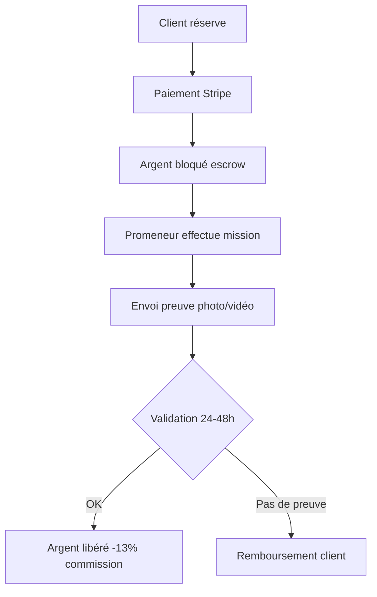

# 📋 CAHIER DES CHARGES COMPLET - DOGWALKING v2.0

## 📌 Informations Générales

| Élément | Valeur |
|---------|--------|
| **Nom du projet** | DogWalking |
| **Type** | Plateforme de mise en relation B2C |
| **Cibles** | Propriétaires de chiens + Promeneurs professionnels |
| **Marché** | France métropolitaine |
| **Stack technique** | React 18 + TypeScript + Vite + Tailwind CSS + Supabase |
| **Date création** | Décembre 2024 |
| **Date mise à jour** | 25 Décembre 2024 |
| **Progression globale** | ~97% |

---

## 🎯 VISION & OBJECTIFS

### Mission
Devenir la plateforme de référence en France pour la promenade et la garde de chiens, en garantissant sécurité, transparence et qualité de service.

### Double parcours utilisateur

**1. Propriétaires de chiens (B2C)**
- Trouver un promeneur de confiance près de chez eux
- Réserver en toute sécurité
- Suivre les prestations en temps réel
- Gérer plusieurs chiens

**2. Promeneurs professionnels (B2B)**
- S'inscrire et être vérifié
- Gérer son planning et ses revenus
- Développer sa clientèle locale
- Obtenir des badges de reconnaissance

### Propositions de valeur uniques

| Différenciateur | Description |
|-----------------|-------------|
| **Vérification complète** | CNI + casier judiciaire + assurance RC |
| **Paiement escrow** | Argent bloqué jusqu'à validation de la prestation |
| **Preuves obligatoires** | Photo/vidéo obligatoire à chaque mission |
| **Assurance 2M€** | Couverture complète incluse |
| **Inscription différée** | Explorer et configurer avant de créer un compte |

---

## ✅ FONCTIONNALITÉS RÉALISÉES (97%)

### 🏠 Pages Publiques (100%)

| Page | Route | SEO | FAQ | Mots | Images | Status |
|------|-------|-----|-----|------|--------|--------|
| Accueil | `/` | ✅ Schema LocalBusiness | ✅ 5 questions | ~2500 | ✅ Hero + 8 sections | ✅ |
| Tarifs | `/tarifs` | ✅ SEOHead + Schema | ✅ 6 questions | ~1600 | ✅ Hero unique | ✅ |
| Sécurité | `/securite` | ✅ SEOHead + Schema | ✅ 6 questions | ~1800 | ✅ Hero unique | ✅ |
| Blog | `/blog` | ✅ Schema Blog | - | ~1200 | ✅ Hero + articles | ✅ |
| Qui sommes-nous | `/qui-sommes-nous` | ✅ SEOHead | ✅ 5 questions | ~900 | ✅ Hero équipe | ✅ |
| Près de chez vous | `/pres-de-vous` | ✅ SEOHead | - | ~1000 | ✅ Carte France | ✅ |
| Trouver Promeneurs | `/walkers` | ✅ SEOHead | - | Dynamique | ✅ Hero + cards | ✅ |
| Profil Promeneur | `/walker/:id` | ✅ Dynamique | - | Dynamique | ✅ Avatar | ✅ |
| CGU | `/cgu` | ⚪ | - | - | - | ✅ |
| Confidentialité | `/confidentialite` | ⚪ | - | - | - | ✅ |
| Mentions Légales | `/mentions-legales` | ⚪ | - | - | - | ✅ |

### 🐕 Pages Services Piliers SEO (100%)

| Page | Route | Mots | FAQ | Images | Status |
|------|-------|------|-----|--------|--------|
| Service Promenade | `/services/promenade` | ~1500 | ✅ 6 questions | ✅ 4 uniques | ✅ |
| Service Garde | `/services/garde` | ~1500 | ✅ 6 questions | ✅ 4 uniques | ✅ |
| Service Visite | `/services/visite` | ~1500 | ✅ 6 questions | ✅ 4 uniques | ✅ |

### 👤 Espace Propriétaire (100%)

| Fonctionnalité | Route | SEO | Animations | Status |
|---------------|-------|-----|------------|--------|
| Dashboard | `/dashboard` | ✅ | ✅ Framer Motion | ✅ |
| Mon Profil | `/profile` | ✅ | ✅ Transitions | ✅ |
| Mes Réservations | `/bookings` | ✅ | ✅ | ✅ |
| Messages | `/messages` | ✅ | ✅ Temps réel | ✅ |
| Ajouter un chien | `/dogs/add` | ⚪ | ✅ | ✅ |
| Réserver | `/book/:walkerId` | ⚪ | ✅ Multi-étapes | ✅ |
| Parrainage | `/referral` | ⚪ | ✅ | ✅ |

### 🚶 Espace Promeneur (100%)

| Fonctionnalité | Route | Status |
|---------------|-------|--------|
| Dashboard Promeneur | `/walker/dashboard` | ✅ Complet avec stats |
| Mes Revenus | `/walker/earnings` | ✅ Graphiques inclus |
| Profil Public | `/walker/:id` | ✅ SEO dynamique |
| Inscription | `/walker/register` | ✅ Formulaire complet |

### 🔐 Authentification (100%)

| Fonctionnalité | Status | Notes |
|---------------|--------|-------|
| Inscription email | ✅ | Avec validation |
| Connexion email | ✅ | Erreurs en français |
| Inscription différée | ✅ | Réservation avant compte |
| Redirection post-auth | ✅ | Retour à l'action en cours |
| Protection routes | ✅ | HOC + redirections |
| Gestion sessions | ✅ | Persistance localStorage |

### 💾 Base de données Supabase (100%)

| Table | RLS | Triggers | Description |
|-------|-----|----------|-------------|
| `profiles` | ✅ | ✅ on_auth_user_created | Profils utilisateurs |
| `dogs` | ✅ | - | Chiens enregistrés |
| `walker_profiles` | ✅ | - | Profils promeneurs détaillés |
| `walker_documents` | ✅ | - | Documents à vérifier |
| `walker_badges` | ✅ | - | Badges et distinctions |
| `walker_earnings` | ✅ | - | Revenus promeneurs |
| `bookings` | ✅ | - | Réservations |
| `messages` | ✅ | - | Messages temps réel |
| `notifications` | ✅ | - | Notifications système |
| `reviews` | ✅ | - | Avis et notes |
| `favorites` | ✅ | - | Promeneurs favoris |
| `referrals` | ✅ | - | Système parrainage |
| `user_roles` | ✅ | - | Rôles (admin, user) |

### 🎨 Design System (100%)

| Élément | Status | Détails |
|---------|--------|---------|
| Tokens HSL | ✅ | Variables CSS sémantiques complètes |
| Composants Shadcn | ✅ | 50+ composants personnalisés |
| Animations Framer Motion | ✅ | Parallaxe, fade, stagger, hover |
| Mode sombre | ✅ | Support complet automatique |
| Responsive | ✅ | Mobile-first, breakpoints cohérents |
| Accessibilité | ✅ | ARIA, focus visible, navigation clavier |
| Bulle flottante contact | ✅ | Animation pulsante, 3 options |

### 🖼️ Images Générées (100%)

| Catégorie | Fichiers | Localisation |
|-----------|----------|--------------|
| Pages principales | 12 images | `src/assets/pages/` |
| Homepage | 5 images | `src/assets/homepage/` |
| Services | 28 images | `src/assets/services/` |
| Testimonials | 2 images | `src/assets/testimonials/` |
| Trust | 2 images | `src/assets/trust/` |
| **Total** | **49 images** | - |

---

## 🟠 À FAIRE - PRIORITÉ HAUTE (3%)

### 💳 Intégration Stripe (Paiement Escrow)

| Tâche | Priorité | Complexité | Status |
|-------|----------|------------|--------|
| Activer intégration Stripe | 🔴 Haute | Faible | ⚪ |
| Edge function `create-checkout` | 🔴 Haute | Moyenne | ⚪ |
| Edge function `stripe-webhook` | 🔴 Haute | Moyenne | ⚪ |
| Système escrow 24-48h | 🔴 Haute | Haute | ⚪ |
| Libération paiement sur preuve | 🔴 Haute | Haute | ⚪ |

**Flux paiement attendu :**


### 📧 Emails Transactionnels

| Email | Déclencheur | Priorité |
|-------|-------------|----------|
| Confirmation inscription | Création compte | 🔴 Haute |
| Nouvelle réservation | Booking créé | 🔴 Haute |
| Confirmation promeneur | Booking accepté | 🔴 Haute |
| Rappel J-1 | Cron 24h avant | 🟠 Moyenne |
| Preuve reçue | Photo uploadée | 🟠 Moyenne |
| Paiement reçu | Escrow libéré | 🔴 Haute |

---

## 🔧 CONFIGURATION REQUISE

### Secrets Supabase

| Secret | Usage | Status |
|--------|-------|--------|
| `SUPABASE_URL` | Connexion DB | ✅ |
| `SUPABASE_ANON_KEY` | Connexion DB | ✅ |
| `SUPABASE_SERVICE_ROLE_KEY` | Admin | ✅ |
| `SUPABASE_DB_URL` | DB directe | ✅ |
| `STRIPE_SECRET_KEY` | Paiements | ⚪ À ajouter |
| `STRIPE_WEBHOOK_SECRET` | Webhooks | ⚪ À ajouter |
| `RESEND_API_KEY` | Emails | ⚪ À ajouter |

---

## 📈 MÉTRIQUES SEO

| Métrique | Cible | Status |
|----------|-------|--------|
| Pages avec meta unique | 100% | ✅ 100% |
| Pages avec H1 unique | 100% | ✅ 100% |
| Images avec alt | 100% | ✅ 100% |
| Sitemap à jour | Oui | ✅ |
| Schema.org | Pages clés | ✅ |
| Mobile-friendly | Oui | ✅ |
| Contenu piliers SEO | 1300-1600 mots | ✅ |
| FAQ Schema.org | Pages services | ✅ |

---

## 📅 ROADMAP

### ✅ Sprint 1 - MVP (Terminé)
- [x] Architecture projet
- [x] Authentification
- [x] Pages publiques
- [x] Recherche promeneurs
- [x] Système de réservation
- [x] Dashboards
- [x] Messagerie
- [x] SEO complet

### 🔜 Sprint 2 - Paiement (À venir)
- [ ] Intégration Stripe
- [ ] Système escrow
- [ ] Emails transactionnels
- [ ] Upload documents promeneurs

### 📋 Sprint 3 - Optimisation
- [ ] Analytics
- [ ] A/B testing
- [ ] Performance
- [ ] PWA mobile

---

## 📝 STANDARDS DE CODE

### Conventions
- TypeScript strict (no any)
- Composants fonctionnels React
- Hooks personnalisés réutilisables
- Design tokens CSS HSL uniquement
- Imports absolus via `@/`
- Composants < 300 lignes

### Structure des composants
```tsx
// 1. Imports
import { useState } from 'react';
import { motion } from 'framer-motion';

// 2. Types/Interfaces
interface Props { ... }

// 3. Composant
const Component = ({ prop }: Props) => {
  // 3.1 Hooks
  // 3.2 Handlers
  // 3.3 Render
  return (...)
};

// 4. Export
export default Component;
```

---

*Document généré le 25 Décembre 2024*
*Version 2.0 - Mise à jour complète UX/UI*
